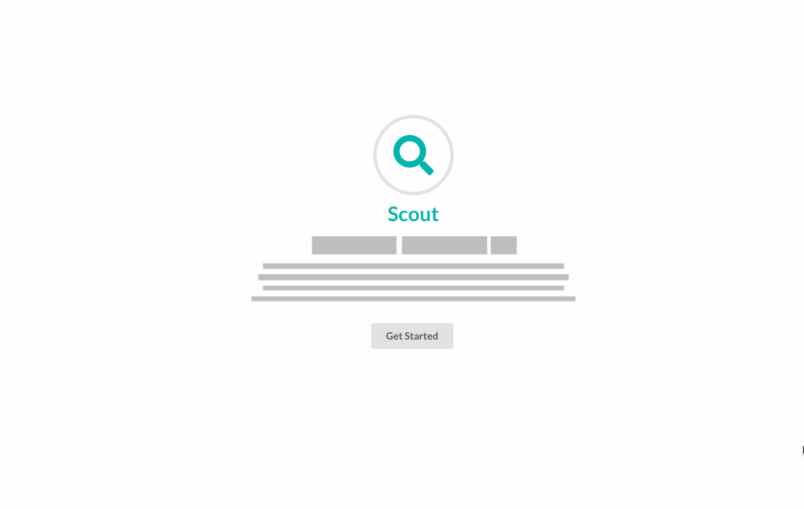

# Scout

## Description:

Scout is designed around the struggle of artists, athletes and creators in getting found and displaying their work.  It is now easier than ever for people to record and upload their work, but no centralized place for people to show off what they can do to the people that it matters most.  By creating a professional product for all types of people, from the athlete or performer wanting to show their work off to colleges or professionals, to artists and creators with families looking for a side gig, people can easily market their hard work into the next big opportunity.  Scout’s objective is to be a tool for people to easily connect with other professionals in their industry, keep their work in a centralized location, and find jobs.

## Requirements:

For development, you will only need Node.js installed on your environement.
And please use the appropriate [Editorconfig](http://editorconfig.org/) plugin for your Editor (not mandatory).

### Node

[Node](http://nodejs.org/) is really easy to install & now include [NPM](https://npmjs.org/).
You should be able to run the following command after the installation procedure
below.

    $ node --version
    v0.10.24

    $ npm --version
    1.3.21

#### Node installation on OS X

You will need to use a Terminal. On OS X, you can find the default terminal in
`/Applications/Utilities/Terminal.app`.

Please install [Homebrew](http://brew.sh/) if it's not already done with the following command.

    $ ruby -e "$(curl -fsSL https://raw.github.com/Homebrew/homebrew/go/install)"

If everything when fine, you should run

    brew install node

#### Node installation on Linux

    sudo apt-get install python-software-properties
    sudo add-apt-repository ppa:chris-lea/node.js
    sudo apt-get update
    sudo apt-get install nodejs

#### Node installation on Windows

Just go on [official Node.js website](http://nodejs.org/) & grab the installer.
Also, be sure to have `git` available in your PATH, `npm` might need it.

## Installation:

1. `git clone` your repo to local
2. Run `npm install` for dependencies
3. Start the dev server using `npm start`
4. Open [http://localhost:3000](http://localhost:3000)

## Make an Account:

This is an example; please don't use 12345678 as a password! 

Scout was created by: Kevin Altieri, Sabrena Beck, Claudia Rodriguez, Nikhil Vaidyamath
